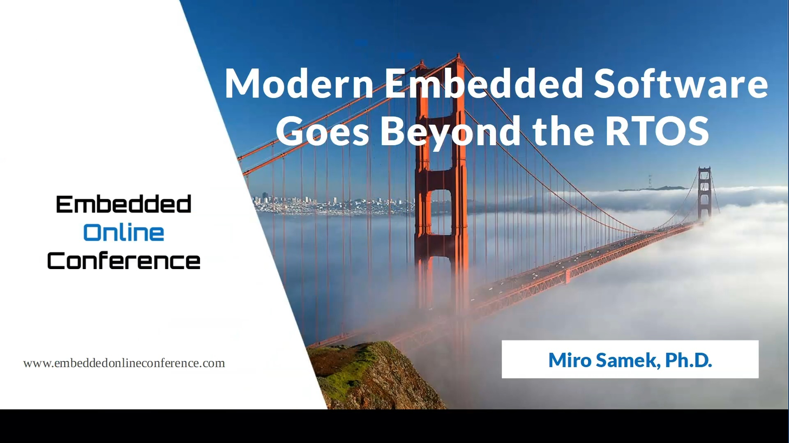

## Brought to you by:
[](https://www.state-machine.com)

--------------------------------------------------------------------------


- [What is it?](#what-is-it)
- [Directories and Files](#directories-and-files)
- [Supported Boards](#supported-boards)
- [Licensing](#licensing)
- [Invitation to Collaborate](#invitation-to-collaborate)
- [How to Help this Project?](#how-to-help-this-project)

# What is it?
"FreeACT" is a minimal real-time embedded framework (RTEF) based on the
FreeRTOS kernel. FreeACT implemetns the Active Object (a.k.a. Actor) design pattern.

This presentation explaining "FreeACT" is available on YouTube in the following playlist:

[](https://www.youtube.com/playlist?list=PLPW8O6W-1chytjkg63-tM7MI0BvGxxPIP)

The material was originally presented by Miro Samek at the
[Embedded Online Conference 2020](https://www.embeddedonlineconference.com/session/Modern_Embedded_Software_Goes_Beyond_the_RTOS)

[](https://www.embeddedonlineconference.com/session/Modern_Embedded_Software_Goes_Beyond_the_RTOS)


# Directories and Files

```
FreeACT/
+---3rd_party/           - third-party software (needed in the examples)
|   +---FreeRTOS-Kernel/ - stripped down FreeRTOS-Kernel (FeeRTOS-202210-LTS)
|   +---CMSIS/           - ARM CMSIS
|   +---efm32pg1b/       - low-level code to support the EFM32PG1B (Pearl Gecko) board
|   +---ek-tm4c123gxl/   - low-level code to support the EK-TM4C123GX (TivaC LaunchPad) board
|   +---nucleo-h743zi/   - low-level code to support the STM32 NUCLEO-H743ZI board
|
+---examples/
|   +---blinky_button/   - Blinky-Button exammple with FreeAct
|   |   +---armclang/    - projects for ARM/KEIL with "compiler 6" (armclang)
|   |   |       efm32pg1b.uvprojx     - project for EFM32PG1B (Pearl Gecko) board
|   |   |       ek-tm4c123gxl.uvprojx - project for EK-TM4C123GX (TivaC LaunchPad) board
|   |   |       nucleo-h743zi.uvprojx - project for STM32 NUCLEO-H743ZI board
|   |   +---gnu/         - makefiles for GNU-ARM toolchain
|   |           ek-tm4c123gxl.mak     - makefile for EK-TM4C123GX (TivaC LaunchPad) board
|   |           nucleo-h743zi.mak     - makefile for STM32 NUCLEO-H743ZI board
|   |
|   +---other-examples/  - other examples coming soon...
|
+---inc/                 - include directory
|       FreeACT.h        - FreeACT interface
+---src/                 - source directory
|      FreeACT.c         - FreeACT implementation
```

# Supported Boards
The examples are provided for the following embedded boards:

- **TivaC LaunchPad (EK-TM4C123GXL)** (ARM Cortex-M4 with single-precision FPU)
<p align="center"></p>

- **Pearl Gecko (EFM32-SLSTK3401A)** (ARM Cortex-M4 with single-precision FPU)
<p align="center"></p>

- **STM32 NUCLEO-H743ZI** (ARM Cortex-M7 with double-precision FPU)
<p align="center"></p>

- other boards comong in the future...

# Licensing
FreeACT is [licensed](LICENSE.txt) under the MIT open source license, which is the same
used in FreeRTOS.


# Invitation to Collaborate
**This project welcomes collaboration!** Please help to improve FreeAct,
port it to other processors, integrate it with other embedded software,
add interesting examples, etc. To avoid fragmentation, this repository is
intended to remain the home of SST. To contribute, please clone, fork,
and submit **pull requests** to incorporate your changes.


# How to Help this Project?
If you like this project, please give it a star (in the upper-right corner of your browser window):


